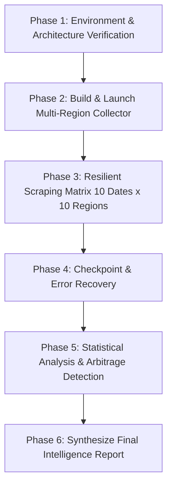

# Overnight Autonomous Study: Regional Dynamic Pricing & Flight POS Arbitrage

> **Target Objective**: Autonomously execute an exhaustive multi-region data collection study on Google Flights, analyze how geographic Points of Sale (POS) and IP routing influence ticket pricing, isolate dynamic pricing mechanisms, and compile an exhaustive intelligence report to be read in the morning.

---

## 1. Prerequisites & Environment Setup

Before launching the overnight session, verify these technical requirements on your machine:

### A. Prevent Windows From Sleeping
If the computer goes to sleep, active network connections terminate and the headless browser will freeze.
* **Option 1 (Power & Battery Settings)**: Set *"When plugged in, turn off screen after..."* to any value, but set *"When plugged in, put my device to sleep after..."* to **Never**.
* **Option 2 (PowerShell Keep-Awake)**:
  Run this one-liner in an admin PowerShell terminal to prevent idle sleep:
  ```powershell
  $wscript = New-Object -ComObject Wscript.Shell
  # Or use PowerToys Awake if installed, or leave laptop plugged in with Sleep = Never
  ```

### B. Python Virtual Environment & Dependencies
Ensure the project virtual environment is active and all required libraries are installed:
```powershell
.\.venv\Scripts\Activate.ps1
python -m pip install playwright pandas tabulate
python -m playwright install chromium
```

### C. Antigravity Execution Mode
To ensure the session **runs continuously without stopping or waiting for intermediate manual approvals**, launch the session with the `/goal` slash command. This forces the autonomous agent into goal-driven mode where it self-corrects, retries on transient network errors, and works until the deliverables are fully produced.

---

## 2. Research Architecture & Hypothesis Testing Matrix

The overnight session is structured around answering four specific questions regarding Google Flights and airline pricing engines:

### Hypothesis 1: The Role of the `gl` Parameter vs. Physical IP
* **Question**: Does changing `&gl=XX` completely override Google's geographic Point of Sale, or does Google Flights still detect and filter based on the user's physical IP address?
* **Test Design**:
  1. Baseline query from Finland (`gl=FI` and no `gl` parameter).
  2. Foreign POS queries (`gl=VN`, `gl=DE`, `gl=TR`, `gl=US`, `gl=QA`) with `curr=EUR`.
  3. Compare DOM metadata, country indicator flags, and currency persistence.

### Hypothesis 2: Airline Fare Bucket Allocation vs. Local OTA Intermediaries
* **Question**: When a price difference appears between regions, is it because the airline itself (e.g., Qatar Airways, Vietnam Airlines, Finnair) filed a different fare bucket for that Point of Sale, or because local Online Travel Agencies (OTAs like Gotogate, Trip.com, Seat24) are quoting different markups/promotions?
* **Test Design**:
  * Extract seller cards for each route. Separate "Book with Airline directly" from "Book with OTA".
  * Determine if airline direct fares fluctuate across regions or if only third-party agencies move.

### Hypothesis 3: Currency Lag & Dynamic Currency Conversion (DCC)
* **Question**: Is "savings" real purchasing power, or an artifact of IATA currency exchange rate delay (e.g. Turkish Lira or Vietnamese Dong conversion)?
* **Test Design**:
  * Query in local currency (`curr=TRY`, `curr=VND`, `curr=USD`) and convert to EUR using live spot FX rates.
  * Compare against Google Flights' internal `curr=EUR` conversion to detect GDS rate divergence.

### Hypothesis 4: Point of Origin (POO) vs. Point of Sale (POS) Interaction
* **Question**: Does the destination country's POS only get cheap rates for flights originating there, or do they also get discounts on outbound flights departing from Europe?
* **Test Design**:
  * Outbound: Helsinki (`HEL`) $\rightarrow$ Hanoi (`HAN`) across 10 regions.
  * Return/Inbound: Hanoi (`HAN`) $\rightarrow$ Helsinki (`HEL`) across the same 10 regions.

---

## 3. The Region Basket (10 Strategic Markets)

The scraper will benchmark the following 10 geographic Points of Sale for each date pair:

| Code | Country | Strategic Rationale |
| :--- | :--- | :--- |
| **FI** | Finland | Baseline (Home market, Point of Origin) |
| **VN** | Vietnam | Destination market (Local carriers, domestic OTAs) |
| **DE** | Germany | Largest European aviation hub (High OTA competition) |
| **FR** | France | Western Europe hub (SkyTeam / Air France / Vietnam Airlines hub) |
| **GB** | United Kingdom | Non-EU European market (High competitive discounting) |
| **TR** | Turkey | Turkish Airlines hub (Frequent currency/POS arbitrage opportunities) |
| **QA** | Qatar | Qatar Airways hub (Middle East carrier pricing strategy) |
| **AE** | UAE | Emirates / Etihad hub |
| **US** | United States | Global benchmark Point of Sale |
| **SE** | Sweden | Nordic peer control (Alternative Scandinavian market) |

---

## 4. Execution Workflow for the Overnight Agent

When the overnight prompt is triggered, the agent will execute the following four stages:



### Phase 1: Verification & Script Generation
* Inspect existing `src/google_flights.py` and `src/common.py`.
* Generate `src/regional_study_scanner.py` incorporating polite request pacing (2–4 seconds), session persistence, and full error trapping so it never crashes on unexpected DOM changes or empty result sets.

### Phase 2: Autonomous Data Collection
* Collect full pricing cards, airline details, flight durations, layovers, and booking options across:
  * Minimum 10 date pairs for December 2026 – January 2027 (`HEL` $\rightarrow$ `HAN`).
  * Reciprocal test pairs (`HAN` $\rightarrow$ `HEL`).
  * 10 distinct Points of Sale (`gl` codes).
  * Minimum sample size: **100–200 granular itinerary observations**.
* Save raw structured JSON checkpoints in `flight_results_study/` after every single region scan.

### Phase 3: Analytical Breakdown
* Ingest all saved JSONs into an analysis script (`analyze_regional_study.py`).
* Identify:
  1. Maximum price spread per date pair (e.g. Highest POS price minus Lowest POS price).
  2. Best overall region for Helsinki $\rightarrow$ Hanoi flights.
  3. Frequency of airline direct discounts vs OTA discounts.
  4. Currency conversion anomalies.

### Phase 4: Report Synthesis
* Output the comprehensive report to `REGIONAL_DYNAMIC_PRICING_REPORT.md`.
* Detail exact instructions on how to use a VPN to book discovered arbitrage fares without triggering airline fraud detection or currency conversion markups.

---

## 5. Ready-To-Use Overnight Prompt

Copy and paste the exact prompt block below into a new Antigravity session. Notice the `/goal` command at the very start:

```markdown
/goal Read OVERNIGHT_REGIONAL_ARBITRAGE_STUDY.md and execute the complete overnight empirical study on Google Flights regional dynamic pricing and Point of Sale (POS) arbitrage. 

You must run autonomously without stopping until the mission is fully achieved.

### Your Mandate:
1. Environment & Tools:
   - Verify the python virtualenv at .venv and check playwright dependencies.
   - Build a robust, resilient multi-region scanner script `src/regional_study_scanner.py` that builds on `src/google_flights.py` and `src/common.py`.
   - The scanner must search across 10 strategic geographic markets (FI, VN, DE, FR, GB, TR, QA, AE, US, SE) for the Helsinki (HEL) to Hanoi (HAN) route across at least 10 key date pairs for December 2026 - January 2027, plus a reverse-route control (HAN -> HEL).
   - Implement polite throttling (2-4s delay between queries), robust selector fallbacks, and incremental JSON saving to `flight_results_study/` so progress is never lost.

2. Comprehensive Data Collection:
   - Collect a large empirical dataset (at least 100-200 distinct observations) containing exact prices, flight durations, layover airports, operating carriers, and candidate booking cards.
   - Specifically test whether the `gl` URL parameter completely controls the market pricing or if client IP address / currency selection introduces variance.

3. Deep Statistical & Mechanistic Analysis:
   - Build an automated analyzer script to process all collected JSON files.
   - Compute the price delta across regions, finding the absolute cheapest Point of Sale for every single date pair.
   - Analyze the underlying mechanisms:
     a) Is dynamic pricing driven by the physical IP address, the route origin/destination, or the `gl` Point of Sale parameter?
     b) Why are prices different across regions (airline GDS fare bucket allocation, local OTA competition, currency lag, airport taxes)?
     c) Which airline offers the greatest regional price variance (e.g. Qatar, Turkish, Emirates, Finnair, Vietnam Airlines)?

4. Deliverable:
   - Synthesize all findings into an exhaustive, publication-grade markdown report: `REGIONAL_DYNAMIC_PRICING_REPORT.md`.
   - The report must include:
     - An Executive Summary for a reader waking up in the morning.
     - A Comprehensive Arbitrage Table (Date Pair x Region x Cheapest Fare x Airline x Savings vs Finland).
     - Concrete answers with empirical evidence to: "How does Google Flights determine price by region?", "Does IP or gl parameter control it?", "Why do airlines set different regional prices?".
     - A Step-by-Step VPN Booking Playbook: Exactly how to connect via VPN to the cheapest discovered region, avoid Dynamic Currency Conversion (DCC), handle payment cards (Wise/Revolut), and avoid fraud flags.

Do not pause or prompt for confirmation during the night; execute each phase systematically until `REGIONAL_DYNAMIC_PRICING_REPORT.md` is complete and verified.
```
